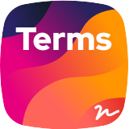

ifdef::env-github[]
++++

  

++++
endif::[]

ifndef::env-github[]

endif::[]

image:https://img.shields.io/packagist/v/rich-id/terms-module-bundle[link="https://packagist.org/packages/rich-id/terms-module-bundle",window="_blank"]
image:https://github.com/rich-id/terms-module/workflows/Tests/badge.svg[link="https://github.com/rich-id/terms-module/actions",window="_blank"]
image:https://coveralls.io/repos/github/rich-id/terms-module/badge.svg?branch=master[link="https://coveralls.io/github/rich-id/terms-module?branch=master",window="_blank"]
image:https://api.codeclimate.com/v1/badges/af5513a99208495d8c40/maintainability[link="https://codeclimate.com/github/rich-id/terms-module/maintainability",window="_blank"]
image:https://img.shields.io/badge/contributions-welcome-brightgreen.svg?style=flat[link="https://github.com/richcongress/test-suite/issues",window="_blank"]
image:https://img.shields.io/badge/license-MIT-blue.svg[link="LICENSE.md",window="_blank"]
image:https://img.shields.io/badge/PHP-7.3%2B-yellow[]
image:https://img.shields.io/badge/Symfony-4%2B-black[]
image:https://img.shields.io/badge/Symfony-5%2B-black[]

A module to quickly implement a terms approvals voter with terms version support.

== Quick showcase

Quick showcase

== Table of content

<<1. Installation>> +
<<2. Documentation>> +
    - link:docs/Configuration.adoc[Configuration] +
    - link:docs/Creation.adoc[Creation] +
    - link:docs/Signatory.adoc[Signatory] +
    - link:docs/Security.adoc[Security] +
    - link:docs/BackOffice.adoc[BackOffice] +
    - link:docs/Events.adoc[Events] +
<<3. Versioning>> +
<<4. Contributing>> +
<<5. License>> +
<<6. Hacking>> +

== 1. Installation

This version of the bundle requires Symfony 4.4+ and PHP 7.3+.

[source,bash]
----
composer require rich-id/terms-module-bundle
----

You must add the routes to your application by adding the following content to the file `config/routes/rich_id_terms_module.yaml`:

[source, yaml]
----
rich_id_terms_module:
    resource: "@RichIdTermsModuleBundle/Resources/config/routing/routing.xml"

# # Edit the path of the routes
# module_terms_sign:
#     path: /cgu/{termsSlug}/signature
#     methods: [GET|POST]
#     defaults: { _controller: RichId\TermsModuleBundle\UserInterface\Controller\SignRoute }
#
# module_terms_terms:
#     path: /cgu/{termsSlug}
#     methods: GET
#     defaults: { _controller: RichId\TermsModuleBundle\UserInterface\Controller\TermsRoute }
----

== 2. Documentation

* link:docs/Configuration.adoc[Configuration]
* link:docs/Creation.adoc[Creation]
* link:docs/Signatory.adoc[Signatory]
* link:docs/Security.adoc[Security]
* link:docs/BackOffice.adoc[BackOffice]
* link:docs/Events.adoc[Events]

== 3. Versioning

terms-module-bundle follows link:https://semver.org/[semantic versioning^]. In short the scheme is MAJOR.MINOR.PATCH where
1. MAJOR is bumped when there is a breaking change,
2. MINOR is bumped when a new feature is added in a backward-compatible way,
3. PATCH is bumped when a bug is fixed in a backward-compatible way.

Versions bellow 1.0.0 are considered experimental and breaking changes may occur at any time.

== 4. Contributing

Contributions are welcomed! There are many ways to contribute, and we appreciate all of them. Here are some of the major ones:

* link:https://github.com/rich-id/terms-module/issues[Bug Reports^]: While we strive for quality software, bugs can happen, and we can't fix issues we're not aware of. So please report even if you're not sure about it or just want to ask a question. If anything the issue might indicate that the documentation can still be improved!
* link:https://github.com/rich-id/terms-module/issues[Feature Request^]: You have a use case not covered by the current api? Want to suggest a change or add something? We'd be glad to read about it and start a discussion to try to find the best possible solution.
* link:https://github.com/rich-id/terms-module/pulls[Pull Request^]: Want to contribute code or documentation? We'd love that! If you need help to get started, GitHub as link:https://help.github.com/articles/about-pull-requests/[documentation^] on pull requests. We use the link:https://help.github.com/articles/about-collaborative-development-models/["fork and pull model"^] were contributors push changes to their personal fork and then create pull requests to the main repository. Please make your pull requests against the `master` branch.

As a reminder, all contributors are expected to follow our [Code of Conduct](CODE_OF_CONDUCT.md).

== 5. License

test-suite is distributed under the terms of the MIT license.

See link:./LICENSE[LICENSE^] for details.

== 6. Hacking

You might use Docker and `docker-compose` to hack the project. Check out the following commands.

[source,bash]
----
# Start the project
docker-compose up -d

# Install dependencies
docker-compose exec application composer install

# Run tests
docker-compose exec application bin/phpunit

# Run a bash within the container
docker-compose exec application bash
----
